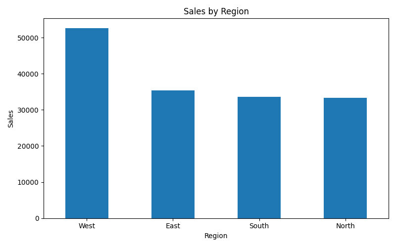
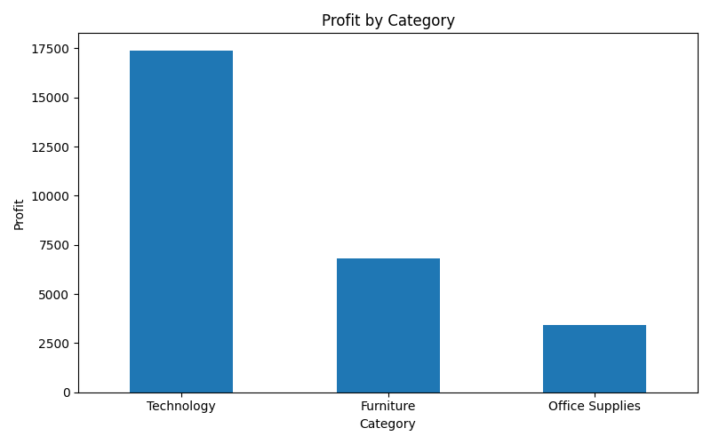
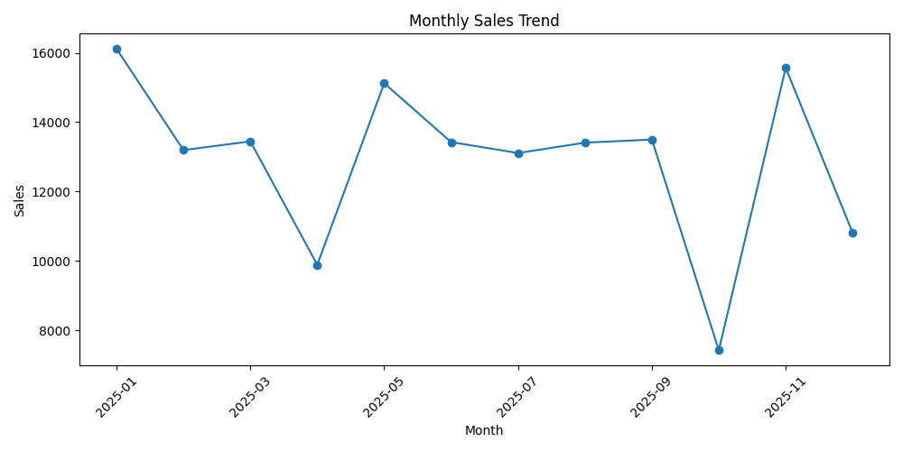

# Retail Sales Analysis

This project analyzes retail sales data to identify patterns in revenue, profitability, and business performance across regions, categories, and sales channels.

## Objective
The goal of this project is to transform raw sales data into actionable business insights that support better decision-making. The analysis focuses on understanding which parts of the business perform best and where there may be opportunities for improvement.

## Business Questions
- Which regions generate the highest sales?
- Which product categories are the most profitable?
- Are high-sales segments also the most profitable?
- How do sales evolve over time?
- Which sales channel performs better?

## Tools Used
- Python
- Pandas
- NumPy
- Matplotlib
- Jupyter Notebook

## Project Structure
```bash
retail-sales-analysis/
├── data/
│   ├── raw/
│   │   └── retail_sales.csv
│   └── processed/
├── images/
│   ├── sales_by_region.png
│   ├── profit_by_category.png
│   └── monthly_trend.png
├── notebooks/
│   └── retail_sales_analysis.ipynb
├── README.md
└── requirements.txt
```

## Analysis Process
Data cleaning and validation
Exploratory data analysis
Visualization of key metrics
Identification of sales and profit trends
Business recommendations based on findings

## Key Insights
Some regions generate strong sales but lower profitability.
Certain categories contribute more to revenue than to margins.
Monthly trends help identify seasonality and performance shifts.
Comparing channels provides useful direction for future commercial strategies.

## Business Recommendations
Prioritize categories with stronger profit performance, not only higher sales volume.
Review the strategy in regions with high sales but lower profitability.
Strengthen the best-performing channel and identify practices that can be replicated.
Use monthly trends to support planning and commercial decision-making.

## Visual Outputs

### Sales by Region


### Profit by Category


### Monthly Sales Trend


## Outcome
This project demonstrates how data analysis can be used to connect business performance with strategic recommendations. It combines technical analysis with a business-oriented perspective.

## Author
Angel Daniel Silva Hernandez  
Business Administration student interested in business analytics, strategy, and data-driven decision-making.
